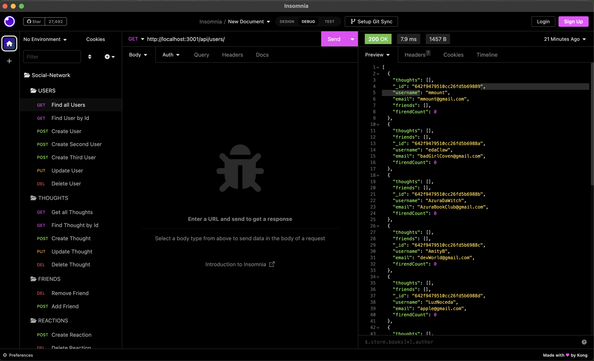
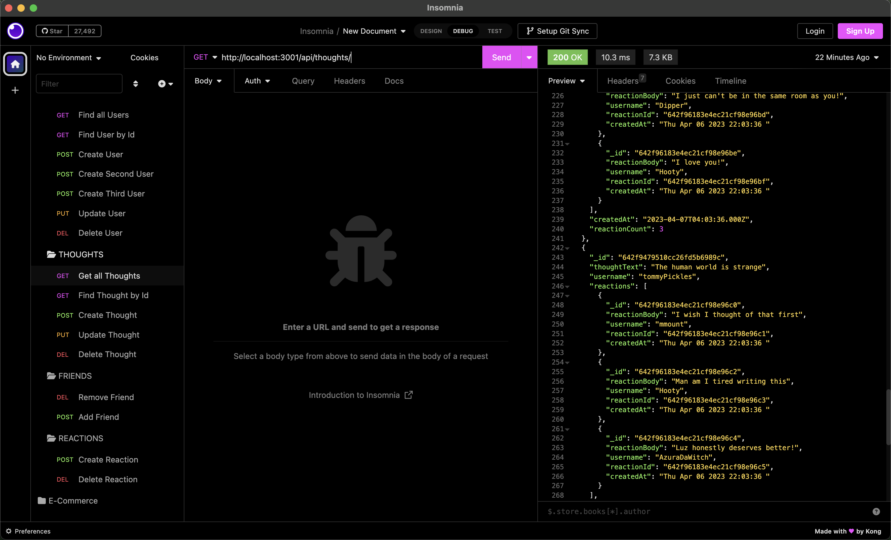
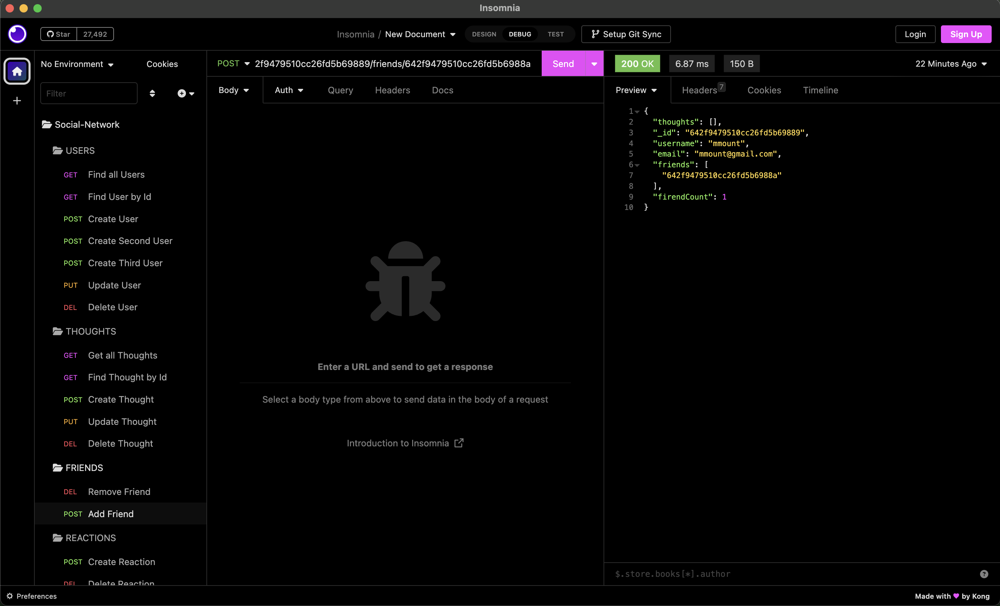

# Social NetWork API 

## Description

This CLI application is built using a mongoDB and stores post(thoughts) from users and comments(reactions) to a post. It is a fully built backend application that can be added to any social media platform! It allows for Users to add Friends and build up a social following around what they think and feel!

[Link to WalkThorugh Video](https://drive.google.com/file/d/15We-SWZftGXvDedMR6JHQoFvqYpMbNYc/view)

# Table of Contents

[Description](#description)

[How to Install](#install)

[How to Use](#usage)

[How to contribute](#contribute)

[Testing](#test)

[License](#license)

[Contact Me](#contact)

## Installation

Please, after cloning the repo, run the command line "npm i" to install the depenicies from npm.com.

This api currently uses:
Express
mongoose pacakges

You will also need to have the MongoDB CLI in-order to interact and with the database. I would recommaned using Mongo Compass to view the database in real time! It is a helpful application, similar to sql workbench, that has a useful UI for interacting directly with the Mongo Database or chekcing the data being updated directly to the server.

## Usage

All that is required to use this API (currently) is a code editor and have mongoDB CLI downloaded in-order to build the database and interact with it. i.e CRUD operations

## Contributing

If you have suggestions and/or would like to contribute, please reach out to me via email!

## Testing

I would recommand testing this before adding to a web application with [insomnia](https://insomnia.rest/)

You can test each route included in the control files to see each operation works and wont return you an error.

Testing Get All Thought Route:

Testing Adding a Friend:

## License

This project is licensed under the MIT license.
See [LICENSE](https://www.mit.edu/~amini/LICENSE.md) for more information!

## Question

If you have any questions or concerns about this project please contact me!

My gitHub account is: mmount98

Link to my [gitHub](https://github.com/mmount98) Account

You can always reach out via my email: mount.photos@gmail.com
